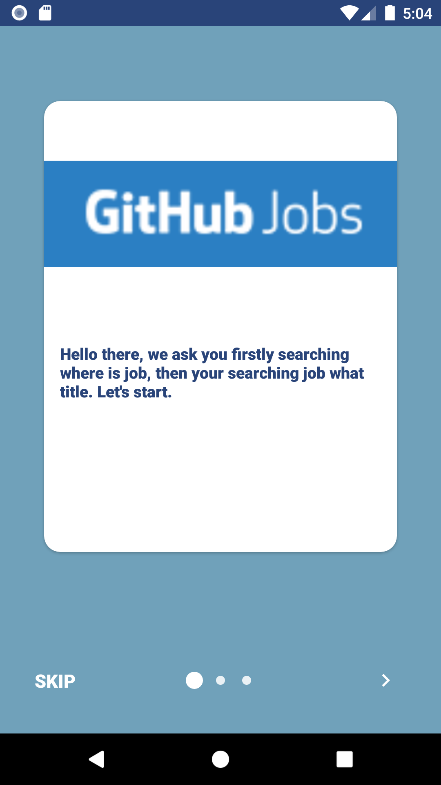
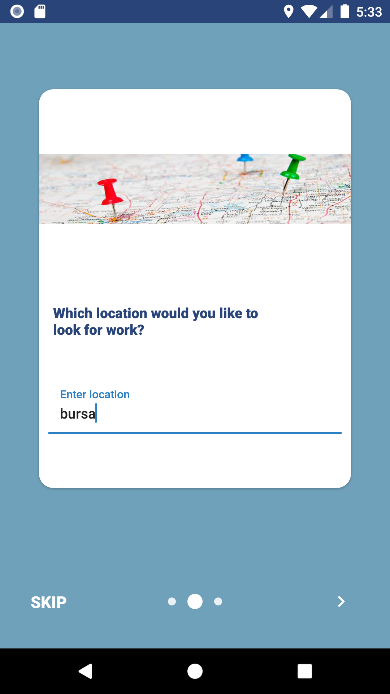
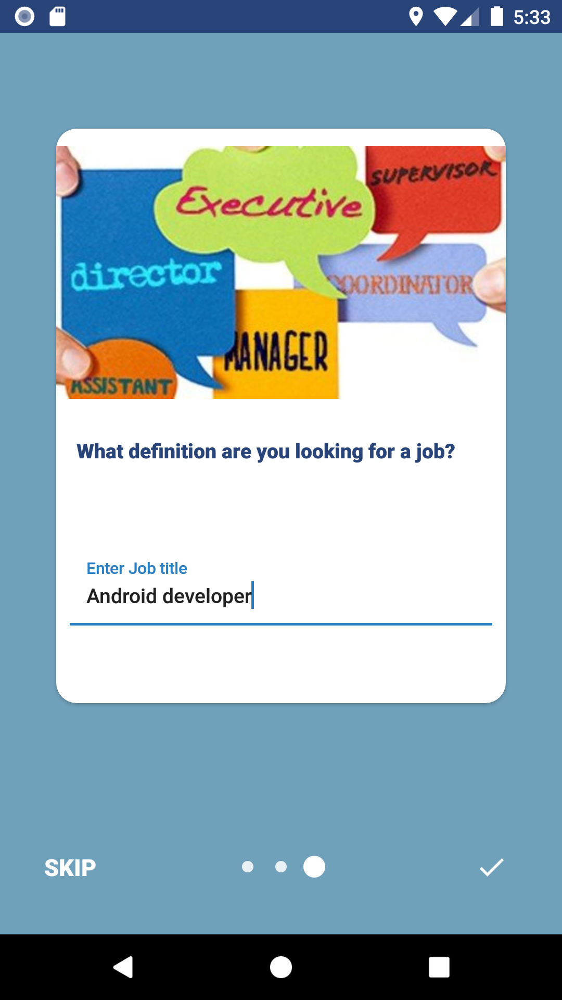
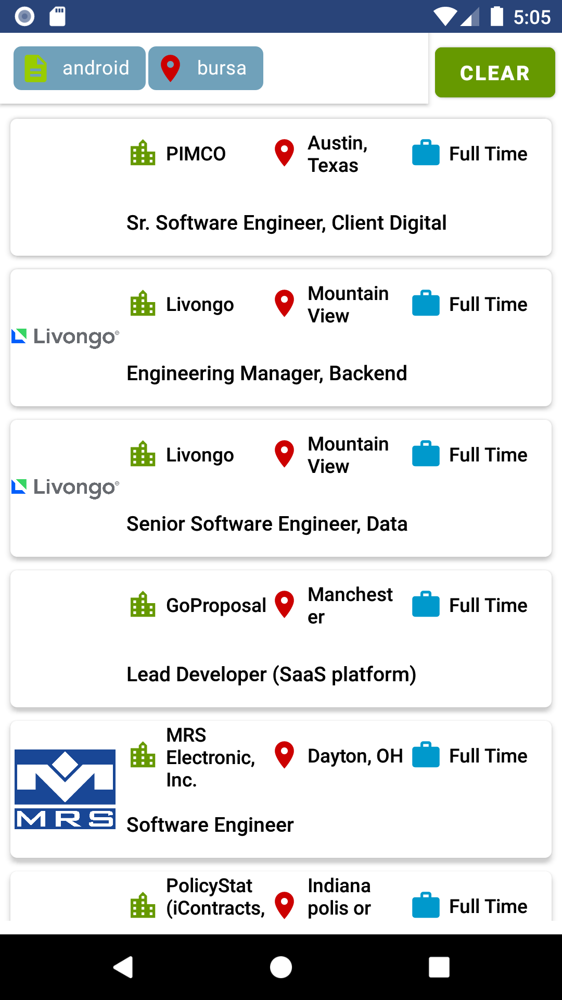

GithubJobs app which was built with modular structure, Kotlin DSL, Koin, Observer pattern.  

Used <a href="https://jobs.github.com/api">Github Jobs API</a>.   

<H2>Tech Stack</H2>

- Kotlin 
- Kotlin DSL
- Koin
- Android Jetpack
  - LiveData
  - ViewModel
  - Navigation
  - Paging
  - Constraint layout
- Retrofit2
- Timber
- Material Design
- Glide

<H2> Layers </H2>

- Data(models and retrofit classes)
- Base (Base classes)
- View(ViewModel classes)

<h2> Screenshots </h2>

<table>
  <tr>
    <th><b>Intro</b></th>
    <th><b>Intro</b></th>
    <th><b>Intro</b> </th>
    <th><b>Home</b> </th>
    <th><b>Details</b> </th>
  
  </tr>
  <tr>
    <td>
      </td>
    <td>
      
    </td>
   <td>
      
    </td>
    <td>
      
    </td>
<td>
      
    </td>
  </tr>
</table>

<h2> Todo </h2>

- [ ] The app will be written in unit test.
